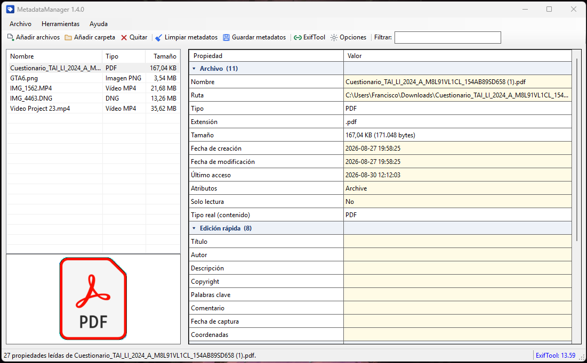

# MetadataManager

[](../../actions/workflows/build.yml)

Aplicación de escritorio (WinForms, .NET 8) para **leer, editar, exportar y eliminar** los metadatos
de archivos: EXIF de fotografías, propiedades de documentos de Office y PDF, e información del
sistema de archivos.



## Características

### Lectura
- Datos del sistema de archivos, resumen (cámara, fecha de captura, resolución, coordenadas GPS) y
  volcado completo de los metadatos incrustados que reconoce
  [MetadataExtractor](https://github.com/drewnoakes/metadata-extractor-dotnet), **agrupados por
  categoría y plegables**.
- **Detección del formato real por los bytes de cabecera**, con aviso si la extensión no coincide
  con el contenido.
- **Huella SHA-256** calculada en segundo plano y cancelable.
- **Vista previa de casi cualquier archivo**: imágenes ya rotadas según su orientación EXIF,
  miniatura de Windows para PDF, Office o vídeo, primeras líneas de los archivos de texto e icono
  del tipo cuando no hay nada mejor. Los ejecutables y scripts esperan a que los autorices.
- Filtro de propiedades, orden de la lista por nombre, tipo o tamaño, y exportación individual o
  **de toda la lista en un único informe**.

### Edición
- Propiedades del sistema de archivos: **nombre, ruta completa** (renombra y mueve a otra carpeta),
  fechas de creación, modificación y último acceso, atributos y la marca de solo lectura.
- **Edición rápida**: con ExifTool conectado aparece siempre una categoría con los campos de uso
  habitual (título, autor, descripción, copyright, palabras clave, comentario, fecha de captura y
  coordenadas), **aunque el archivo no los tenga todavía**. Sirve para *añadir* metadatos a una
  imagen o un PDF que no tiene ninguno, no solo para modificar los existentes.
- **Etiquetas incrustadas** cuando ExifTool está conectado:
  - EXIF: autor, copyright, descripción, software, comentarios, marca y modelo de cámara, objetivo,
    números de serie, valoración, etiquetas XP de Windows, todas las fechas y el ISO.
  - IPTC: autor, titular, pie de foto, palabras clave, ciudad, país, crédito, fuente, instrucciones…
  - XMP: cualquier propiedad simple (`dc:title` se escribe como `XMP-dc:Title`).
  - Coordenadas GPS desde la fila «Resumen → Coordenadas», en formato `latitud, longitud`.
  - Un valor vacío **elimina** la etiqueta del archivo.
- Solo se ofrece editar lo que se puede escribir de vuelta: los valores que MetadataExtractor
  reformatea para mostrarlos (`1/125 sec`, `f/2.8`, `Top, left side`) quedan de solo lectura, porque
  devolverlos tal cual fallaría.

### Borrado de metadatos
| Formato | Alcance sin ExifTool |
| --- | --- |
| JPEG, PNG | Completo y **sin recomprimir**: se descartan los segmentos APPn/COM y los chunks auxiliares |
| PDF | Completo: diccionario `/Info` y bloque XMP (mediante [PDFsharp](https://www.pdfsharp.net/)) |
| DOCX, XLSX, PPTX | Completo: autor, empresa, fechas y propiedades personalizadas |
| BMP, GIF, TIFF | La imagen se regenera sin metadatos (implica recomprimir) |
| Resto | Solo se normalizan las fechas; hace falta ExifTool |

- Si [ExifTool](https://exiftool.org/) está disponible se usa siempre primero, con vuelta atrás
  automática al método interno si falla.
- **La orientación de las imágenes se conserva**: al borrar el EXIF se reinserta un bloque mínimo con
  la etiqueta de orientación, para que las fotos verticales no se vean giradas.
- Tres modos de trabajo sobre los originales: sobrescribir, **crear copia de seguridad `.bak`**
  (por defecto) o **dejar el original intacto y generar una copia limpia**.

### Interfaz
- Español e inglés, seleccionables en las opciones.
- Preferencias persistentes (tamaño de ventana, divisor, última carpeta, modo de limpieza, fecha de
  normalización), guardadas en `%APPDATA%\MetadataManager\settings.ini`, editable a mano.
- Arrastrar y soltar, selección múltiple, menús contextuales, apertura de coordenadas en Google Maps
  y barra de estado con el progreso de cada operación.

## Requisitos

- Windows con [.NET 8 Desktop Runtime](https://dotnet.microsoft.com/download/dotnet/8.0), o el
  ejecutable autocontenido, que no necesita nada instalado.
- Opcional: [ExifTool](https://exiftool.org/). La aplicación lo busca en la ruta que hayas conectado
  a mano, junto a su propio ejecutable y en el `PATH`. Si no lo tienes en el `PATH`, pulsa el botón
  **ExifTool** de la barra (o haz clic en el indicador de la barra de estado) y seleccionas
  `exiftool.exe`: la ruta se valida ejecutándolo y se recuerda entre sesiones. Sin él no está
  disponible la edición de etiquetas EXIF.

## Compilar, probar y publicar

```bash
dotnet build                                  # compilación
dotnet run                                    # ejecución
dotnet run -- "C:\ruta\foto.jpg"              # abre la aplicación con archivos ya cargados
dotnet test tests/MetadataManager.Tests       # 163 pruebas automatizadas

# Ejecutable único que no requiere el runtime de .NET
dotnet publish -c Release -r win-x64 -p:PublishSingleFile=true
```

## Estructura del proyecto

| Ruta | Contenido |
| --- | --- |
| `Program.cs` | Punto de entrada, idioma y captura de errores no controlados. |
| `MainForm.cs` | Ventana principal: orquesta lista, tabla y operaciones. |
| `OptionsForm.cs` | Diálogo de preferencias. |
| `Models/` | `MetadataEntry` (propiedad mostrada) y `FileEntry` (elemento de la lista). |
| `Services/MetadataService.cs` | Lectura de metadatos y cálculo del SHA-256. |
| `Services/MetadataEditor.cs` | Validación y escritura de propiedades y etiquetas. |
| `Services/MetadataCleaner.cs` | Estrategias de borrado, modos de salida y fechas. |
| `Services/LosslessImageStripper.cs` | Borrado sin recomprimir en JPEG y PNG. |
| `Services/OpenXmlCleaner.cs`, `PdfCleaner.cs` | Limpieza de documentos de Office y PDF. |
| `Services/ExifTool.cs`, `ExifWritableTags.cs` | Herramienta externa y etiquetas escribibles. |
| `Services/MetadataExporter.cs` | Exportación individual y por lotes a CSV, JSON y TXT. |
| `Services/SafeFileWriter.cs` | Sustitución atómica del contenido de un archivo. |
| `Services/AppSettings.cs`, `Localization.cs`, `Glyphs.cs`, `FileTypes.cs` | Preferencias (.ini), idioma, iconos y tipos. |
| `Services/FileColumnLayout.cs` | Reparto de anchos de las columnas de la lista de archivos. |
| `Resources/Strings*.resx` | Textos de la interfaz (español neutro e inglés). |
| `tests/MetadataManager.Tests/` | Pruebas con xUnit de toda la capa de servicios. |

La capa de servicios no depende de WinForms, por lo que puede reutilizarse y se prueba por separado.

## Aviso

El borrado de metadatos **modifica los archivos de forma irreversible** salvo que uses el modo de
copia de seguridad o el de copia limpia. Comprueba el modo activo en Herramientas → Opciones.

## Licencia

MIT. Consulta el archivo [LICENSE](LICENSE).
