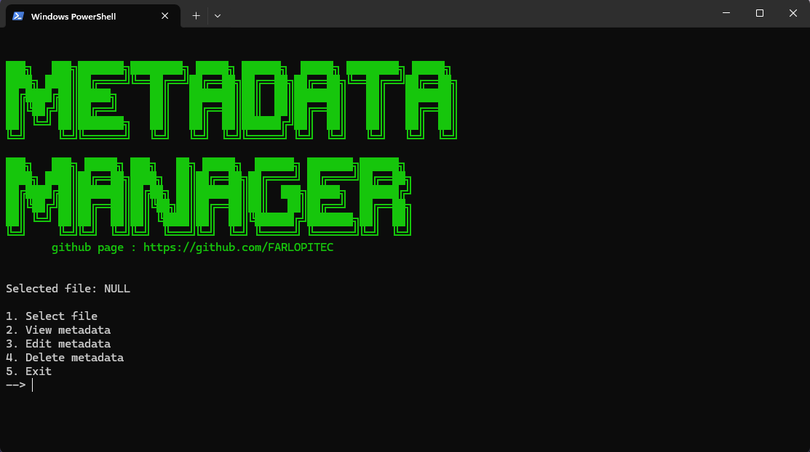

# 🧠 MetadataManager
[🇪🇸 Español](docs/README-ES.md) | [🇬🇧 English](README.md)

Python application to view, modify, and delete file metadata through a console interface. It uses `exiftool` to manipulate metadata and `tkinter` to select files from a pop-up window. Ideal for photographers, developers, or anyone who needs to manage metadata easily.



## ⚠️ Legal Notice

This software is provided for educational and personal use. **I am not responsible for any misuse of this tool by others.** Any modification, deletion, or alteration of metadata is entirely the responsibility of the user.

## ✨ Features ✨

- 📁 Graphical file selection using `tkinter`
- 🔍 Detailed metadata visualization with `exiftool`
- 📝 Edit individual EXIF, GPS, date, camera, software, etc. fields
- ❌ Complete metadata removal from any compatible file
- 💾 Option to save metadata in a `.txt` file
- 🎨 Clean, interactive console menu

## 🖥️ Requirements

- ✅ Python 3.7 or higher
- ✅ [ExifTool](https://exiftool.org/) installed and accessible from the command line:
	- **Windows**:  
	    Download and install from [exiftool.org](https://exiftool.org/)
	- **Linux**:  
	    ```bash
	    sudo apt install libimage-exiftool-perl
	    ```
	- **macOS**:  
	    ```bash
	    brew install exiftool
	    ```
- ✅ `tkinter` module (included by default in most Python distributions)


## 📦 Installation Guide ⚙️
1. Clone the repository:
   ```bash
   git clone https://github.com/FARLOPITEC/MetadataManager.git
   cd MetadataManager
   ```

2. Install Python requirements (if needed):
   ```bash
   pip install tk
   ```

3. Make sure `exiftool` is installed (see Requirements section).


## 📋 Usage Guide 🕹️

1. Run the main script:
   ```bash
   python MetadataManager.py
   ```

2. From the main menu you can:
   - Select a file
   - View its metadata
   - Edit any individual field
   - Delete all metadata from the file
   - Save a copy of the metadata to a `.txt` file


## 🤝 Contributions 🤝

Contributions are welcome! If you find a bug or have an improvement in mind:
- Fork the repository
- Create a branch
- Open a pull request

## 📜 License

📄 This project is licensed under the MIT License. See the `LICENSE` file for more details.

**Developed with ❤️ by [Francisco](https://github.com/FARLOPITEC)**
